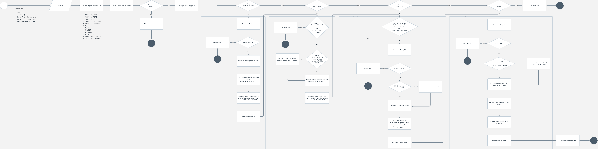

## Pré-requisitos
1. Docker instalado (https://docs.docker.com/get-docker/)

## Estrutura

- ```.docker```: Configurações de contêiners usados no ```docker-compose.yml```
- ```data```: Fontes de dados de entrada (script de criação Postgres e CSV) e locais (nas pastas com cujos nomes são datas)
- ```dbdata```: Pasta com os volumes compartilhados dos contêiners (Postgres e MongoDB)
- ```dist```: Arquivos transpilados (Typescript -> Javascript)
- ```environment```: Arquivos de configuração de ambiente
- ```node_modules```: Bibliotecas/Dependências do projeto
- ```src```: Arquivos fontes do projeto
    - ```exception```: Arquivos de exceções do projeto
    - ```pipelines```: Pipelines do projeto. Atualmente, só há a pipeline ```process-orders```
        - ```job.ts```: Interface padrão de um job (serviço) a ser processado pelas pipelines
        - ```pipeline.ts```: Interface padrão de uma pipeline
        - ```process-orders.pipeline.ts```: Código-fonte da pipeline ```process-orders```  
    - ```steps```: Classes que realizam cada um dos passos usados/orquestrados pelas pipelines
        - ```base.step.ts```: Classe base que todo passo deve herdar
        - ```copy-csv-to-local-file.step.ts```: Classe que implementa o passo que copia os dados do arquivo ```order_details.csv``` para um arquivo local (com formato padronizado)
        - ```copy-local-files-to.bi.step.ts```: Classe que implementa o passo que copia os dados dos pedidos (orders) dos arquivos locais (padronizados) para a base de dados que exportará para o arquivo final
        - ```copy-postgres-to-local-file-config.step.ts```: Classe que implementa o passo que transfere os dados da base de dados Postgres para arquivo locais (com formato padronizado)
        - ```export-orders-with-details.step.ts```: Classe que implementa o passo que executa uma consulta no banco de dados com os dados consolidados dos pediso e exporta para aquivo JSON
        - ```step-id.type.ts```: Enum que relaciona os passos das pipelines
        - ```step.interface.ts```: Interface padrão de um passo
    - ```types```: Tipos de dados usados pelas classes do projeto
    - ```utils```: Classes e funções acessórias usadas em várias partes do projeto
        - ```logger```: Classes customizadas para log
    - ```index.ts```: Ponto de entrada do programa. É responsável por tratar os parâmetros de entrada e invocar os comandos/pipelines corretamente
    - ```docker-compose.yml```: Arquivo com as configurações para subir todos os contêiners em Docker
    - ```nodemon.json```: Arquivo de configuração do serviço de hot reload do projeto (durante modo de desenvolvimento)
    - ```package.json```: Arquivo com as configurações gerais do projeto Node (incluindo as dependências de outras bibliotecas)
    - ```tsconfig.json```: Arquivo com as configurações do transpilador Typescript -> Javascript
    - ```yarn.lock```: Arquivo de cache das resoluções das dependências do projeto

## Rodando o projeto em ambiente DEV

Copie o arquivo `environment/.env.example` para `environment/.env` e defina os valores das conexões com banco de dados. Se estiver usando os contêiners do arquivo ```docker-compose.yml```, garanta que os dados de conexão sejam os menos no ```environment/.env```. Por exemplo:

```javascript
POSTGRES_HOST=db
POSTGRES_PORT=5432
POSTGRES_USER=northwind_user
POSTGRES_PASSWORD=thewindisblowing
POSTGRES_DATABASE=northwind

BI_HOST=bi
BI_PORT=27017
BI_USER=
BI_PASSWORD=
BI_DATABASE=code-challenge

SOURCE_DATA_FOLDER=data
LOCAL_DATA_FOLDER=data
```

```bash
$ docker compose up
```

Para variar os parâmetros de entrada do programa no modo DEV, abra o arquivo ```nodemon.json``` e o valor do atributo ```exec```.

## Compilando e testando o projeto

```bash
$ yarn build
```
Será criada a pasta ```dist``` com os arquivos compilados.

Para testar o projeto compilado, execute:

```bash
$ node dist/index.js process-orders <data>
``` 
*Veja a documentação completa em [CLI](#cli)*


A documentação completa do programa pode ser obtida executando:

```bash
$ node dist/index.js -h
```

## CLI

O ponto de entrada do projeto (```index.js```) roda seguindo a sintaxe:

```bash
$ index.js process-orders <date> [options]
```
onde ```<date>``` deve ser um valor no formato AAAA-MM-DD (por exemplo, 2023-01-01).

As opções disponíveis são:

| Opção               | Descrição |
|---------------------|-----------|
| -s, --start <step>  | Indica a partir de qual passo a pipeline deve ser executada. Valores possíveis: [postgres_to_local, csv_to_local, local_to_bi, export]. Default: postgres_to_local. |
| -l, --logger <type> | Tipo de log. Valores possíveis: [none, console, file]. Default: none. |
| -o, --output <file> | Indica o caminho do arquivo de log. Obrigatório quando --logger=file. |
| -r, --result <file> | Indica o nome do arquivo que conterá o resultado do programa. Default: orders_\<date\>.json. |
| -h, --help          | Exibe a ajuda do programa |
| -V, --version       | Exibe a versão programa |

### Exemplos

Roda a pipeline para a data ```2023-01-01```, iniciando pelo último passo (exportação dos dados dos pedidos), gerando logs no arquivo ```output.log``` e gravando o resultado final no arquivo ```result.json```
```bash
$ node index.js process-orders 2023-01-01 --start export --logger file --output output.log --result result.json
```

## Tecnologias usadas

- **NodeJS**: Ambiente para desenvolvimento de aplicações backend e standalone, usando Javascript como linguagem base. Foi escolhido pela simplicidade e praticidade para se criar um projeto que realiza as operações necessárias para este desafio (conexão com banco de dados, interação via linha de comando, leitura/escrita de arquivos)
- **TypeScript**: Linguagem de programação fortemente tipada, construída sobre o Javascript e cujo código é transpilado para Javascript. O fato do Typescript disponibilizar tipagem e estruturas para construção de código orientado a objetos, oferece mais robustez e facilita detecção de problemas ainda em tempo de codificação e compilação.
- **Postgres**: Gerenciador de banco de dados usado como requisito do desafio. Utilizou-se a biblioteca ```pg```, para ter total controle sobre a conexão e diminuir o overhead do sistema (se comparado a um ORM, por exemplo, o mongoose). 
- **MongoDB**: Banco de dados NoSQL. Foi utilizado como tecnologia para armazenar os dados consolidados dos pedidos (pré-exportação para o formato final). Oferece grande performance e é de fácil configuração e utilização. O fato de trabalhar com documentos estruturados (ao invés de tabelas relacionais), serviu como critério para sua adoção neste projeto - visto que já seria possível armazenar os dados dos pedidos no mesmo formato do arquivo final que o programa gera. 
- **JSON**: Estrutura de dados em formato de árvore, onde os atributos seguem um conceito de chave-valor. Atualmente é amplamente utilizado para trafegar dados entre sistemas, por ser assumir um formato de texto e ser agnóstico de tecnologias, frameworks ou linguagem de programção. Como o JSON possui uma estrutura muito semelhante aos objetos do Javascript e aos documentos do MongoDB, ele também foi utilizado para armazenar dos dados nos arquivos locais (para consolidação dos dados do Postgres e arquivos CSV) 
- **Inquirer**: Biblioteca utilizada para criar camada de interação com o programa por meio de CLI
- **Docker**: É uma forma moderna de trabalhar com ambientes isolados (sandboxes), conhecidos como contêiners, para executar programas diversos (como sistemas operacionais, bancos de dados, servidores de páginas, etc) sem necessidade de instalação desses programas no sistema operacional hospedeiro (evitando, assim, "poluir" as configurações e processo deste último). O Docker foi utilizado para rodar o Postgres, o MongoDB e servir como ambiente para rodar o projeto em NodeJS. 
- **Nodemon**: Biblioteca que permite rodar um programa de forma a ficar monitorando seu estado e realizar recarga automática quando algum conteúdo é alterado (hot reload). Muito útil em fase de desenvolvimento, pois o projeto é recarregado cada vez que uma atualização no códio-fonte é aplicada.
- **Dotenv**: Estratégia para carregar configurações necessárias dentro do código-fonte a partir de um arquivo do tipo chave-valor. Foi adotado neste projeto para evitar que os parâmetros do programa ficassem fixos no código-fonte (hardcoded).

## Fluxograma

